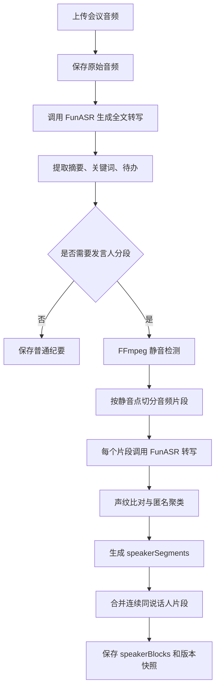

# 会议纪要无样本发言人区分功能与 C++ SDK 完整方案

## 1. 背景与目标

当前项目已经具备会议纪要生成能力：用户上传会议或课堂录音后，系统可以完成语音转写、摘要生成、关键词提取、待办提取、历史保存和详情页展示。

新增需求是：即使用户没有提前上传发言人样本，也希望在会议纪要中区分不同发言人，例如显示为：

- 说话人 1：今天我们先讨论项目进度。
- 说话人 2：我这边数据库已经完成。
- 说话人 1：那前端页面还有哪些问题？

当前 Java 后端已实现一个基础版方案：不依赖单独的说话人分离模型，而是组合使用 FFmpeg、FunASR 和声纹比对模型，实现无样本发言人自动聚类。

本文档目标：

1. 说明当前项目中该功能的真实实现原理。
2. 说明 FunASR 和声纹模型的具体调用方式。
3. 给出 C++ SDK 的完整设计方案。
4. 给出 SDK 开发里程碑、接口设计、测试计划和风险控制。

## 2. 当前功能定位

该功能建议命名为：

**Meeting Speaker Diarization without Enrollment**

中文可称为：

**无样本会议发言人自动区分**

它和传统功能的区别如下：

| 能力 | 是否需要发言人样本 | 输出结果 |
| --- | --- | --- |
| 普通 ASR 转写 | 不需要 | 一整段全文文本 |
| 已注册发言人匹配 | 需要 | 张三、李四等真实姓名 |
| 无样本发言人区分 | 不需要 | 说话人 1、说话人 2、说话人 3 |
| 完整说话人日志 | 可选 | 每个片段的时间、文本、发言人标签 |

当前实现的核心思想：

1. 先把长音频切成若干语音片段。
2. 每个片段单独转写。
3. 用声纹模型比较不同片段的声音相似度。
4. 相似片段归为同一个匿名说话人。
5. 最终输出带时间轴的发言人纪要。

## 3. 当前 Java 后端实现流程

### 3.1 前端提交参数

会议纪要页提交表单时，会包含：

```text
title
sceneType
selectedSpeakerIds
autoDiarization=true
file
```

其中：

- `selectedSpeakerIds`：用户手动选择的已注册发言人档案，可以为空。
- `autoDiarization`：是否开启无样本自动区分发言人，当前默认开启。

如果 `selectedSpeakerIds` 为空，但 `autoDiarization=true`，后端仍会进行发言人切片和匿名聚类。

### 3.2 后端总流程

当前会议纪要处理流程如下：



### 3.3 音频切片逻辑

后端使用 FFmpeg 的静音检测能力：

```bash
ffmpeg -i input.wav -af silencedetect=noise=-30dB:d=0.4 -f null -
```

参数说明：

- `noise=-30dB`：低于该音量认为是静音。
- `d=0.4`：静音持续超过 0.4 秒才作为切分参考。

代码中使用两个正则提取 FFmpeg 输出：

```text
silence_start: <seconds>
silence_end: <seconds>
```

再根据静音区间反推出有效说话区间。

当前策略：

- 最短片段：1.2 秒
- 最长片段：12 秒
- 如果没有检测到静音，则按最长 12 秒切分

这样做的原因：

1. 片段太短，声纹模型不稳定。
2. 片段太长，可能混入多个说话人。
3. 12 秒以内更适合逐段转写和声纹比较。

### 3.4 每个片段单独转写

每个切出来的音频片段会被保存为临时 wav 文件，然后调用 FunASR。

调用方式：

```http
POST http://127.0.0.1:8002/asr
Content-Type: multipart/form-data

file=<segment.wav>
batch_size_s=300
hotword=<optional>
```

返回中主要读取：

```json
{
  "text": "这一段识别出的文本"
}
```

或者：

```json
{
  "transcription": [
    {
      "text": "第一句"
    },
    {
      "text": "第二句"
    }
  ]
}
```

后端会兼容这两种格式。

### 3.5 有样本时的实名匹配

如果用户选择了发言人档案，例如：

```text
selectedSpeakerIds=1,3,4
```

后端会读取这些发言人的样本音频，并将每个会议片段和这些样本逐一比较。

调用声纹模型：

```http
POST http://127.0.0.1:8004/verify
Content-Type: multipart/form-data

file1=<speaker_sample.wav>
file2=<segment.wav>
```

声纹模型返回：

```json
{
  "status": "success",
  "file1_name": "sample.wav",
  "file2_name": "segment.wav",
  "score": 0.83,
  "threshold": 0.72,
  "is_same_person": true,
  "message": "same speaker"
}
```

判断规则：

- 如果 `is_same_person=true`，则认为匹配成功。
- 匹配成功后，片段发言人名称使用已注册发言人的姓名。
- 如果多个样本都返回分数，则选择分数最高的结果。

### 3.6 无样本时的匿名聚类

如果没有选择任何发言人样本，系统会自动创建匿名发言人簇。

当前逻辑：

1. 第一个有效片段创建 `说话人 1`。
2. 第二个片段开始，拿当前片段和已有匿名簇的代表音频逐个比对。
3. 如果声纹模型判断为同一人，则归入已有簇。
4. 如果没有任何簇匹配，则创建新的匿名簇，例如 `说话人 2`。

匿名聚类使用的接受条件：

```text
is_same_person == true
或
score >= 0.72
```

其中 `0.72` 是当前后端设定的匿名聚类阈值。

伪代码：

```text
clusters = []

for segment in segments:
    if clusters is empty:
        create cluster "说话人 1" using segment as representative
        continue

    bestCluster = null
    bestScore = null

    for cluster in clusters:
        result = voiceprint.compare(cluster.representativeAudio, segment.audio)
        if result.is_same_person or result.score >= 0.72:
            if bestScore is null or result.score > bestScore:
                bestCluster = cluster
                bestScore = result.score

    if bestCluster exists:
        assign segment to bestCluster
    else:
        create new cluster "说话人 N"
```

### 3.7 混合模式：有样本 + 匿名补充

当前功能支持混合模式。

例如用户只选择了张三的样本，但会议里有张三、李四、王五：

1. 张三的片段会优先匹配成“张三”。
2. 李四和王五因为没有样本，会进入匿名聚类。
3. 最终可能输出：

```text
张三
说话人 1
说话人 2
张三
说话人 1
```

这比“没有匹配上就显示未知发言人”更适合真实会议场景。

## 4. 当前模型服务说明

### 4.1 FunASR HTTP 服务

默认配置：

```yaml
funasr:
  http-base-url: http://127.0.0.1:8002
  asr-path: /asr
  health-path: /
```

HTTP 转写接口：

```http
POST /asr
```

表单字段：

| 字段 | 类型 | 是否必填 | 说明 |
| --- | --- | --- | --- |
| file | file | 是 | 音频文件 |
| batch_size_s | int | 否 | 批处理窗口，默认 300 |
| hotword | string | 否 | 热词 |

推荐 SDK 返回结构：

```cpp
struct AsrResult {
    std::string text;
    std::string rawJson;
};
```

### 4.2 声纹比对服务

默认配置：

```yaml
voiceprint:
  http-base-url: http://127.0.0.1:8004
  compare-path: /verify
  health-path: /
```

声纹比对接口：

```http
POST /verify
```

表单字段：

| 字段 | 类型 | 是否必填 | 说明 |
| --- | --- | --- | --- |
| file1 | file | 是 | 样本音频或匿名簇代表音频 |
| file2 | file | 是 | 当前待判断片段 |

推荐 SDK 返回结构：

```cpp
struct VoiceprintCompareResult {
    std::string status;
    std::string file1Name;
    std::string file2Name;
    double score = 0.0;
    double threshold = 0.0;
    bool hasScore = false;
    bool samePerson = false;
    std::string message;
};
```

## 5. C++ SDK 设计目标

SDK 建议先做成 **远程模型服务调用版**，不要第一版就把 FunASR 和声纹模型嵌入 C++ 进程。

原因：

1. 当前项目已经有可用的 HTTP 模型服务。
2. C++ 直接加载 ASR、声纹模型会涉及 ONNX、TorchScript、CUDA、音频预处理等复杂依赖。
3. 比赛展示更需要稳定性，HTTP SDK 更容易调试。
4. 后续可以再做 Native Runtime 版本。

第一版 SDK 目标：

- C++ 调用 FunASR HTTP 服务完成转写。
- C++ 调用声纹 HTTP 服务完成相似度比较。
- C++ 调用 FFmpeg 命令完成静音检测和切片。
- C++ 内部实现匿名发言人聚类。
- 输出结构化 JSON。

## 6. SDK 总体架构

推荐目录结构：

```text
voice_factory_sdk/
  CMakeLists.txt
  README.md
  include/
    voice_factory/
      sdk.hpp
      types.hpp
      asr_client.hpp
      voiceprint_client.hpp
      audio_segmenter.hpp
      diarizer.hpp
      meeting_note.hpp
      error.hpp
  src/
    asr_client.cpp
    voiceprint_client.cpp
    audio_segmenter.cpp
    diarizer.cpp
    meeting_note.cpp
    sdk.cpp
  examples/
    diarize_file.cpp
    transcribe_file.cpp
    meeting_note_demo.cpp
  tests/
    test_audio_segmenter.cpp
    test_diarizer.cpp
    test_json_output.cpp
```

模块职责：

| 模块 | 职责 |
| --- | --- |
| `AsrClient` | 调用 FunASR HTTP `/asr` |
| `VoiceprintClient` | 调用声纹 `/verify` |
| `AudioSegmenter` | FFmpeg 静音检测、音频切片 |
| `Diarizer` | 匿名说话人聚类、有样本优先匹配 |
| `MeetingNote` | 汇总全文、片段、发言块、JSON 输出 |
| `VoiceFactorySDK` | 对外统一入口 |

## 7. SDK 数据结构设计

### 7.1 SDK 配置

```cpp
struct SdkConfig {
    std::string funasrBaseUrl = "http://127.0.0.1:8002";
    std::string funasrAsrPath = "/asr";

    std::string voiceprintBaseUrl = "http://127.0.0.1:8004";
    std::string voiceprintComparePath = "/verify";

    std::string ffmpegPath = "ffmpeg";
    std::string ffprobePath = "ffprobe";

    int connectTimeoutMs = 5000;
    int readTimeoutMs = 300000;
};
```

### 7.2 处理参数

```cpp
struct DiarizationOptions {
    bool autoDiarization = true;
    double anonymousThreshold = 0.72;
    double minSegmentSeconds = 1.2;
    double maxSegmentSeconds = 12.0;
    double silenceNoiseDb = -30.0;
    double silenceDurationSeconds = 0.4;
    int batchSizeSeconds = 300;
    std::string hotword;
};
```

### 7.3 发言人样本

```cpp
struct SpeakerProfile {
    int id = 0;
    std::string name;
    std::string role;
    std::string sampleAudioPath;
};
```

### 7.4 语音片段

```cpp
struct Segment {
    int index = 0;
    double startSeconds = 0.0;
    double endSeconds = 0.0;
    std::string audioPath;
    std::string transcript;
    int speakerProfileId = 0;
    std::string speakerName;
    double matchScore = 0.0;
    bool hasMatchScore = false;
};
```

### 7.5 发言人块

连续属于同一个人的片段可以合并成发言块。

```cpp
struct SpeakerBlock {
    std::string speakerName;
    double startSeconds = 0.0;
    double endSeconds = 0.0;
    std::string transcript;
    int segmentCount = 0;
};
```

### 7.6 最终结果

```cpp
struct MeetingDiarizationResult {
    std::string fullTranscript;
    std::vector<Segment> segments;
    std::vector<SpeakerBlock> speakerBlocks;
    std::string rawJson;
};
```

## 8. 对外 API 设计

### 8.1 顶层 SDK

```cpp
class VoiceFactorySDK {
public:
    explicit VoiceFactorySDK(SdkConfig config);

    AsrResult transcribeFile(
        const std::string& audioPath,
        int batchSizeSeconds = 300,
        const std::string& hotword = ""
    );

    VoiceprintCompareResult compareSpeakers(
        const std::string& audioPathA,
        const std::string& audioPathB
    );

    MeetingDiarizationResult diarizeMeeting(
        const std::string& audioPath,
        const DiarizationOptions& options = {},
        const std::vector<SpeakerProfile>& profiles = {}
    );
};
```

### 8.2 使用示例

```cpp
#include <voice_factory/sdk.hpp>
#include <iostream>

int main() {
    voice_factory::SdkConfig config;
    config.funasrBaseUrl = "http://127.0.0.1:8002";
    config.voiceprintBaseUrl = "http://127.0.0.1:8004";

    voice_factory::VoiceFactorySDK sdk(config);

    voice_factory::DiarizationOptions options;
    options.autoDiarization = true;
    options.anonymousThreshold = 0.72;

    auto result = sdk.diarizeMeeting("meeting.mp3", options);

    for (const auto& block : result.speakerBlocks) {
        std::cout << block.speakerName << ": "
                  << block.transcript << std::endl;
    }

    return 0;
}
```

## 9. SDK 核心算法设计

### 9.1 音频切片算法

输入：原始音频路径。

输出：若干 `TimeRange`。

步骤：

1. 调用 `ffprobe` 获取总时长。
2. 调用 `ffmpeg silencedetect` 获取静音区间。
3. 将静音区间转换为说话区间。
4. 过滤短于 `minSegmentSeconds` 的片段。
5. 长于 `maxSegmentSeconds` 的片段继续切分。
6. 调用 `ffmpeg -ss start -to end` 导出 wav 片段。

切片命令示例：

```bash
ffmpeg -y -i input.mp3 -ss 12.3 -to 20.8 -ac 1 -ar 16000 segment_001.wav
```

建议 SDK 输出统一使用：

- 单声道
- 16kHz
- wav

这样更适合 ASR 和声纹模型。

### 9.2 匿名聚类算法

推荐第一版使用“代表样本聚类”：

```text
每个 cluster 保存一个 representativeAudio
新片段只和每个 cluster 的 representativeAudio 比较
匹配上则归入该 cluster
匹配不上则新建 cluster
```

优点：

- 实现简单。
- 调用次数较少。
- 和当前 Java 后端一致。

缺点：

- 如果代表样本质量差，后续判断可能受影响。

第二版可升级为“多代表样本聚类”：

```text
每个 cluster 保存最多 K 个代表片段
新片段和 cluster 内多个代表片段比较
取最高分或平均分
```

建议：

- V1：每个 cluster 1 个代表样本。
- V2：每个 cluster 最多 3 个代表样本。
- V3：引入声纹 embedding，直接做向量聚类。

### 9.3 有样本优先策略

SDK 应该保持和后端一致：

1. 如果传入 `SpeakerProfile`，先做实名匹配。
2. 如果实名匹配成功，使用真实姓名。
3. 如果实名匹配失败，并且 `autoDiarization=true`，进入匿名聚类。
4. 如果 `autoDiarization=false`，标记为 `未知发言人`。

伪代码：

```text
for segment in segments:
    transcript = asr.transcribe(segment.audio)

    namedMatch = matchNamedSpeaker(segment, profiles)
    if namedMatch.accepted:
        segment.speakerName = namedMatch.name
        continue

    if options.autoDiarization:
        anonymousMatch = assignAnonymousSpeaker(segment)
        segment.speakerName = anonymousMatch.label
    else:
        segment.speakerName = "未知发言人"
```

## 10. HTTP 客户端实现建议

建议使用：

- `libcurl`：HTTP multipart 上传。
- `nlohmann/json`：JSON 解析。

CMake 依赖：

```cmake
find_package(CURL REQUIRED)
find_package(nlohmann_json REQUIRED)

target_link_libraries(voice_factory_sdk
    PUBLIC
        CURL::libcurl
        nlohmann_json::nlohmann_json
)
```

FunASR 上传示意：

```cpp
curl_mime* mime = curl_mime_init(curl);

curl_mimepart* filePart = curl_mime_addpart(mime);
curl_mime_name(filePart, "file");
curl_mime_filedata(filePart, audioPath.c_str());

curl_mimepart* batchPart = curl_mime_addpart(mime);
curl_mime_name(batchPart, "batch_size_s");
curl_mime_data(batchPart, "300", CURL_ZERO_TERMINATED);

curl_easy_setopt(curl, CURLOPT_MIMEPOST, mime);
```

声纹上传类似，只是字段名为：

```text
file1
file2
```

## 11. JSON 输出格式建议

SDK 最终可以输出以下 JSON：

```json
{
  "fullTranscript": "完整会议转写文本",
  "speakerBlocks": [
    {
      "speakerName": "说话人 1",
      "startMs": 0,
      "endMs": 8500,
      "transcript": "今天我们先讨论项目进度。",
      "segmentCount": 2
    }
  ],
  "speakerSegments": [
    {
      "index": 1,
      "startMs": 0,
      "endMs": 4200,
      "speakerName": "说话人 1",
      "matchScore": null,
      "transcript": "今天我们先讨论项目进度。"
    }
  ]
}
```

这样可以直接给：

- Web 前端展示
- Java 后端接入
- 命令行工具输出
- 后续 Python/Java/Node 绑定使用

## 12. 开发里程碑

### M1：最小可用 SDK

目标：完成单文件会议音频的无样本发言人区分。

任务：

1. 搭建 CMake 项目。
2. 实现 `AsrClient`。
3. 实现 `VoiceprintClient`。
4. 实现 `AudioSegmenter` 的 FFmpeg 调用。
5. 实现 `Diarizer` 匿名聚类。
6. 输出 JSON。

验收标准：

- 输入 `meeting.mp3`。
- 输出包含 `speakerSegments`。
- 至少能显示 `说话人 1`。
- 多人音频中能生成多个匿名发言人标签。

### M2：实名样本匹配

目标：支持传入发言人样本。

任务：

1. 支持 `SpeakerProfile` 列表。
2. 实现样本优先匹配。
3. 实现实名匹配失败后的匿名补充分组。
4. 输出 `speakerProfileId` 和 `speakerName`。

验收标准：

- 有样本的人显示真实名字。
- 无样本的人显示匿名标签。

### M3：命令行工具

目标：提供可直接演示的 CLI。

命令示例：

```bash
voice-factory-diarize \
  --audio meeting.mp3 \
  --funasr http://127.0.0.1:8002 \
  --voiceprint http://127.0.0.1:8004 \
  --out result.json
```

支持参数：

| 参数 | 说明 |
| --- | --- |
| `--audio` | 输入音频 |
| `--out` | 输出 JSON |
| `--threshold` | 匿名聚类阈值 |
| `--hotword` | 热词 |
| `--min-segment` | 最短片段 |
| `--max-segment` | 最长片段 |

### M4：工程化与跨平台

目标：让 SDK 更像正式产品。

任务：

1. 增加 Windows/macOS/Linux 编译说明。
2. 增加错误码。
3. 增加日志回调。
4. 增加进度回调。
5. 增加单元测试。
6. 增加 GitHub Actions 构建。

## 13. 错误码设计

建议统一错误码：

```cpp
enum class ErrorCode {
    Ok = 0,
    FileNotFound,
    InvalidAudio,
    FfmpegNotFound,
    FfmpegFailed,
    FunasrUnavailable,
    FunasrRequestFailed,
    VoiceprintUnavailable,
    VoiceprintRequestFailed,
    JsonParseFailed,
    InternalError
};
```

建议异常类：

```cpp
class VoiceFactoryException : public std::runtime_error {
public:
    VoiceFactoryException(ErrorCode code, const std::string& message);
    ErrorCode code() const noexcept;
};
```

## 14. 进度回调设计

会议音频可能较长，SDK 最好支持进度回调。

```cpp
enum class Stage {
    ProbingAudio,
    DetectingSilence,
    CuttingSegments,
    Transcribing,
    MatchingSpeakers,
    MergingBlocks,
    Finished
};

using ProgressCallback = std::function<void(Stage stage, int current, int total)>;
```

使用示例：

```cpp
options.onProgress = [](Stage stage, int current, int total) {
    std::cout << current << "/" << total << std::endl;
};
```

## 15. 性能优化方案

### 15.1 并发转写

片段转写可以并发，但要限制并发数。

建议：

- 默认并发：2
- 最大并发：4
- 避免把 FunASR 服务打满

### 15.2 声纹比对缓存

同一个片段和同一个代表音频的比较结果可以缓存。

缓存 key：

```text
hash(file1) + ":" + hash(file2)
```

### 15.3 减少声纹调用次数

如果会议中片段很多，匿名聚类复杂度接近：

```text
O(片段数 * 发言人数)
```

通常可以接受。

如果片段超过 200 个，可以考虑：

1. 限制最大匿名说话人数。
2. 先按相邻片段做快速合并。
3. 每个 cluster 保存多个代表样本但限制比较数量。

## 16. 测试计划

### 16.1 单元测试

| 测试项 | 目标 |
| --- | --- |
| `AudioSegmenter` | 能正确解析 FFmpeg 静音输出 |
| `splitLongRange` | 长片段能按最大长度切分 |
| `Diarizer` | 相似片段归为同一人 |
| `Diarizer` | 不相似片段创建新说话人 |
| `JsonOutput` | 输出字段完整 |

### 16.2 集成测试

准备三类音频：

1. 单人音频
2. 双人对话音频
3. 三人会议音频

验收：

- 单人音频不应生成过多说话人。
- 双人音频应能分出两个主要说话人。
- 三人音频应能形成多个匿名标签。

### 16.3 和 Java 后端对齐测试

同一个音频分别用：

1. Java 后端处理
2. C++ SDK 处理

对比：

- 片段数量
- 发言人标签数量
- 每段起止时间
- 转写文本是否一致
- 声纹分数是否一致

## 17. 已知风险与改进方向

### 17.1 当前方案的风险

| 风险 | 原因 | 解决方案 |
| --- | --- | --- |
| 说话人切换点不够准 | 只用静音切片，不是真正 VAD + diarization | 后续引入 VAD 或专门 diarization 模型 |
| 同一人被拆成多人 | 声纹片段过短或噪声大 | 提高最短片段长度，使用多代表样本 |
| 多人同时说话难处理 | 片段里混入多个声音 | 引入重叠说话检测 |
| 调用次数较多 | 每段都要 ASR 和声纹比对 | 并发、缓存、合并短片段 |
| 阈值不适配所有场景 | `0.72` 是经验值 | 支持配置和自动校准 |

### 17.2 后续升级方向

V2 可以升级为：

1. 使用 FunASR/SenseVoice 输出更细粒度时间戳。
2. 引入 VAD 模型替代 FFmpeg 静音检测。
3. 引入 speaker embedding，直接做向量聚类。
4. 引入 pyannote 风格 diarization pipeline。
5. C++ Native 版加载 ONNX 模型，减少 HTTP 依赖。

## 18. C++ SDK 与当前项目的集成方式

短期建议：

```text
前端 -> Java 后端 -> C++ SDK CLI/Library -> FunASR/Voiceprint 服务
```

Java 后端可以通过两种方式接入：

1. 调用 C++ SDK 编译出的命令行工具。
2. 通过 JNI 调用 C++ 动态库。

比赛和演示阶段建议优先使用 CLI：

```bash
voice-factory-diarize --audio meeting.mp3 --out result.json
```

原因：

- 接入快。
- 崩溃隔离好。
- 日志好查。
- 不影响现有 Java 服务稳定性。

长期产品化再考虑 JNI 或直接把 C++ SDK 做成独立微服务。

## 19. 推荐第一版开发顺序

建议按以下顺序开发：

1. `types.hpp`：先定义所有结构体。
2. `http_client.hpp/cpp`：封装 libcurl。
3. `asr_client.hpp/cpp`：打通 FunASR。
4. `voiceprint_client.hpp/cpp`：打通声纹比对。
5. `audio_segmenter.hpp/cpp`：打通 FFmpeg 静音切片。
6. `diarizer.hpp/cpp`：实现匿名聚类。
7. `meeting_note.hpp/cpp`：实现合并发言块和 JSON 输出。
8. `examples/diarize_file.cpp`：做可运行 Demo。
9. 加测试。
10. 写 README。

## 20. 最小可交付版本定义

第一版 SDK 只要做到以下功能，就可以认为可交付：

1. 输入一个本地音频文件。
2. 自动调用 FFmpeg 切片。
3. 自动调用 FunASR 转写每个片段。
4. 自动调用声纹服务完成匿名聚类。
5. 输出 JSON 文件。
6. 命令行能直接演示。

最小命令：

```bash
voice-factory-diarize --audio meeting.mp3 --out result.json
```

最小输出：

```json
{
  "speakerBlocks": [
    {
      "speakerName": "说话人 1",
      "transcript": "大家好，我们开始今天的会议。"
    },
    {
      "speakerName": "说话人 2",
      "transcript": "我先汇报一下数据库进展。"
    }
  ]
}
```

## 21. 总结

当前项目中的无样本发言人区分功能，本质上是一个工程化组合方案：

```text
FFmpeg 静音切片
+ FunASR 分段转写
+ 声纹模型片段相似度比较
+ 匿名说话人聚类
= 无样本会议发言人区分
```

该方案适合比赛和项目展示，因为它不要求用户提前录入每个人的声纹样本，同时又能在会议纪要中形成清晰的“谁说了什么”的结构。

C++ SDK 第一版建议保留 HTTP 模型服务架构，重点把音频切片、模型调用、聚类和 JSON 输出封装成稳定接口。后续再逐步升级到本地 ONNX/TorchScript 模型推理，实现真正的离线 SDK。
