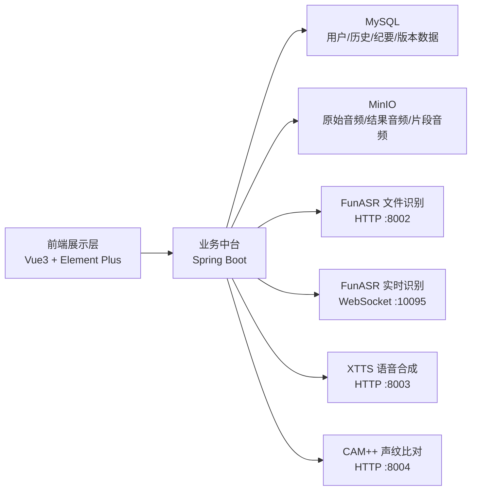

# 比赛材料第一章、第二章

## 第一章 需求分析

随着课堂录音、会议讨论、访谈采集和语音资料整理场景越来越常见，用户对语音信息处理的需求已经不再局限于“把音频转成文字”这一单一功能，而是逐步扩展到实时转写、结果留存、语音合成、声纹核验、纪要整理和文档导出等连续流程。现有不少工具往往只覆盖其中某一个环节，例如只提供录音转写、只提供文字转语音，或只提供声纹验证，导致用户在真实使用中需要频繁切换平台，数据分散，历史结果不易追溯，也不利于后续复核和整理。基于这一痛点，本项目开发了“特辣油语音工厂”，希望将语音识别、实时转写、文字转语音、声纹对比和智能纪要整合到同一平台中，形成统一入口、统一存储、统一历史管理的完整闭环。

本作品面向的用户主要包括三类。第一类是学生用户，主要用于课堂录音整理、知识点回顾和小组讨论纪要生成；第二类是教师和管理人员，主要用于会议记录、课堂资料留存、重点待办提取和发言回溯；第三类是需要进行语音处理实验或内容生成的用户，主要关注文字转语音、声纹比对和多模块联动能力。

本项目的主要功能包括：离线录音转文字、实时语音识别、文字转语音、声纹对比、发言人档案管理、会议/课堂智能纪要、纪要人工校正、历史记录管理以及多格式文档导出。其中，智能纪要模块不仅能够生成全文转写、摘要、关键词和待办事项，还支持基于发言人样本进行音频分段匹配，形成结构化的发言片段和发言块，增强纪要结果的可读性与可复核性。

从性能与工程目标看，本作品强调三个方面：一是功能闭环，支持从上传音频到结果生成、历史留存和导出的完整流程；二是数据可追溯，识别文本、合成结果、声纹对比分数、纪要内容和原始音频均可在数据库与 MinIO 中回查；三是系统可扩展，前端、Java 后端和 Python 模型服务分层设计，后续可继续替换更优模型或扩展更多语音场景。

从功能形态上看，本作品可对标常见的单功能录音转写工具、单功能语音合成 Demo 和单功能声纹比对系统，但本作品的优势在于多能力融合和统一数据管理。竞品对比可概括如下表：

| 对比维度 | 常见单功能转写工具 | 常见单功能合成/比对 Demo | 本作品 |
| --- | --- | --- | --- |
| 功能覆盖 | 多为单一转写 | 多为单一合成或单一比对 | 转写、实时识别、合成、声纹、纪要一体化 |
| 历史管理 | 通常较弱 | 通常较弱 | 各模块均支持历史记录追溯 |
| 数据留存 | 多为临时结果 | 多为临时结果 | 数据库存索引，MinIO 音频留存 |
| 发言人管理 | 通常不支持 | 通常不支持 | 支持发言人档案注册与复用 |
| 纪要能力 | 少量支持基础摘要 | 通常不支持 | 支持摘要、关键词、待办、校正、导出 |
| 工程完整度 | 偏工具化 | 偏模型演示 | 前后端分离，多服务协同，链路完整 |

综合来看，本作品的核心价值不只是“调用了几个语音模型”，而是围绕真实应用场景，把原本分散的语音处理能力整合为一个可使用、可展示、可继续迭代的软件系统。这也是本作品进行开发和参赛的主要原因。

## 第二章 概要设计

本项目采用“Vue3 前端 + Spring Boot 后端 + Python 模型服务 + MySQL + MinIO”的总体架构。前端负责页面展示与交互，Spring Boot 作为统一业务中台负责鉴权、接口编排、历史落库和对象存储管理，Python 服务负责完成具体模型推理，MySQL 保存结构化业务数据，MinIO 保存原始音频、生成音频和纪要切分片段音频。整体设计目标是实现多模块统一入口、统一鉴权、统一存储和统一追溯。

### 2.1 系统总体结构图

### 2.2 功能模块层次图

```mermaid
flowchart TD
    A["特辣油语音工厂"] --> B["用户与权限模块"]
    A --> C["录音转文字模块"]
    A --> D["实时语音识别模块"]
    A --> E["文字转语音模块"]
    A --> F["声纹对比模块"]
    A --> G["智能纪要模块"]
    A --> H["历史与导出模块"]

    B --> B1["注册/登录/JWT鉴权"]
    B --> B2["个人主页/统一工作台"]

    C --> C1["音频上传"]
    C --> C2["批量/单条转写"]
    C --> C3["文本回填/历史复用"]

    D --> D1["麦克风采集"]
    D --> D2["WebSocket流式转发"]
    D --> D3["实时文本合并显示"]

    E --> E1["参考音频上传"]
    E --> E2["文本/情感/语言控制"]
    E --> E3["结果试听与下载"]

    F --> F1["双音频上传"]
    F --> F2["相似度计算"]
    F --> F3["发言人档案管理"]

    G --> G1["会议/课堂模式"]
    G --> G2["摘要/关键词/待办提取"]
    G --> G3["发言人分段匹配"]
    G --> G4["人工校正与版本快照"]

    H --> H1["各模块历史记录"]
    H --> H2["原音/结果音频回放"]
    H --> H3["TXT/MD/DOCX导出"]
```

### 2.3 模块调用关系说明

1. 用户登录后，前端通过 JWT 调用 Spring Boot 统一接口，后端完成身份校验。
2. 录音转文字模块上传音频后，后端先写入历史记录和 MinIO，再调用 FunASR 文件识别服务，最后保存文本结果。
3. 实时语音识别模块由前端采集 PCM 音频，Spring Boot 通过 WebSocket 代理转发到 FunASR 实时服务，并在结束后保存流式识别历史。
4. 文字转语音模块上传参考音频和文本后，由后端统一调用 XTTS 服务，并把参考音频与结果音频同时写入 MinIO 和数据库。
5. 声纹对比模块上传两段音频后，由后端调用 CAM++ 服务获得相似度、阈值和判定结果，并保存双音频历史。
6. 智能纪要模块既可上传新音频，也可复用录音转写历史；系统后台异步完成全文转写、摘要和待办提取，并在选择发言人档案时结合 ffmpeg 切分与声纹比对完成发言人匹配。
7. 所有模块的历史结果最终统一进入数据库和 MinIO，供个人工作台、历史抽屉和详情页进行查看、回放、下载和导出。

### 2.4 主要接口与人机界面设计

系统前端主要界面包括：录音转文字、实时语音、文字转语音、声纹对比、智能纪要、纪要详情、登录注册和个人主页。其中主业务界面均采用统一导航和卡片式交互布局，用户可以在各模块中直接进入历史记录、查看状态、试听音频、下载结果或继续复用历史数据。  

后端主要接口分为五组：`/api/funasr/*`、`/api/tts/*`、`/api/voiceprint/*`、`/api/speaker/*`、`/api/meeting/*`。这种按业务域划分的接口设计有利于模块解耦，也便于后续扩展新的语音处理能力。

### 2.5 后续优化与研究方向

在现有系统基础上，后续可以继续从三个方向优化：一是针对长音频场景引入异步队列、分段识别和更高性能推理方式，提升大文件处理稳定性；二是进一步优化智能纪要算法，引入更强的摘要与任务抽取策略，提升纪要结构化质量；三是完善部署形态，例如增加 Docker 化部署、模型服务监控和权限细分机制，使系统从课程项目进一步走向更稳定的工程化应用。
